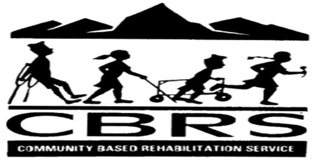

<!DOCTYPE html>
<html lang="en">
<head>
    <meta charset="UTF-8">
    <meta name="viewport" content="width=device-width, initial-scale=1.0">
    <title>CBRS</title>

    <meta name="viewport" content="width=device-width, initial-scale=1">

    <!-- CSS
    ================================================== -->
    <link rel="stylesheet" href="css/styles.css">
    <link rel="stylesheet" href="css/vendor.css">

     <!-- mobile specific metas
    ================================================== -->
    <meta name="viewport" content="width=device-width, initial-scale=1">
    <!-- script
    ================================================== -->
    
    
<!-- script for commom header 
    ================================================== -->
  

    <!-- favicons
    ================================================== -->
   
    <link rel="manifest" href="site.webmanifest">
</head>
<body id="top">

    <!-- header
    ================================================== -->
   <!-- header
    ================================================== -->
    <header class="s-header">
      

          

              
          

          <nav class="s-header__nav">
              <ul>
                  <li class="current"><a class="smoothscroll" href="#home">Home</a></li>
                  <li><a class="smoothscroll" href="#contact">Contact</a></li>
                  <li><a class="smoothscroll" href="#services">Services</a></li>
                  <li><a class="smoothscroll" href="#projects">Projects</a></li>
                  <li><a class="smoothscroll" href="pages\grid-gallery.html">Gallery</a></li>
                  <li><a class="smoothscroll" href="#about">About Us</a></li>
                  <li><a class="smoothscroll" href="pages\donate.html">Donate</a></li>

                  
              </ul>
          </nav>

          <a class="s-header__menu-toggle " href="#0" title="Menu">
              
          </a>

      
 <!-- end row -->
  </header> <!-- end s-header -->

    
    
    

    <section class="auto-slider">
        

            <figure>
        
        
        
        
        
        
        

      

    </figure>
    

</section>

<!-- About Us Section -->

<!-- End of About Us  Section -->

  <!-- Projects Section -->
  <section id="projects">
    

      

        <h1 class="section-title"> <h1><BIg>Projects Conducted</BIg></h1></h1>
      

      

        

          

            <h1>Project 1</h1>
            
cruthes support  via  ward chairman

        

          

            
          

        

        

          

            <h1>Project 2</h1>
            
Provision shop support in village

        

          

            
          

        

        

          

            <h1>Project 3</h1>
            
Stationery support in Annapurna village

        

          

            
          

        

        

          

            <h1>Project 4</h1>
            
School bag support

        

          

            
          

        

        

          

            <h1>Project 5</h1>
            
Community Support

        

          

            
          

        

      

    

  </section>
  <!-- End Projects Section -->

  <!-- Start Contactus Section -->
<!-- Contact Section -->
<section id="contact">
  

    
<h1 class="section-title">Contact Info</h1>

    

      

        

        

          <h1>Phone</h1>
          <h2>Phone:	+977-61-537326 </h2>
            <h2>Fax: +977-61-537326 
            </h2>
        

      

      

        

        

          <h1>Email</h1>
          <a href="mailto:cbrsnepal@gmail.com"><h2>CBRS@org.np</h2></a>
          <h2>PO Box:	293, Nayabazaar, Pokhara, Nepal</h2>
        

      

      

        

        

          <h1>Address</h1>
          <h2>Pokhara, Nepal</h2>
        

      

    

  

</section>
<!-- End Contact Section -->

  <!-- Start Activities Section -->
<!-- Service Section -->
<section id="services">
  

    

      <h2 class="section-title">Services</h2>
          
<h2>Community Based Rehabilitation Service</h2> <big>(CBRS)</big>
             was established in 1995 and has prepared and implementing the periodic plans. Now CBRS has to develop the next five years strategic plan which may guide the clear route for service delivery and its sustainability. 
            Vision: 
 
 “A Society which respects the rights & dignity of people with disabilities and those who are marginalized and disadvantaged, and which gives them the opportunity to fulfill their potential on an equal basis.”
          
 

   Goals:
  To improve the daily and future quality of life of the people with disabilities and their family members so that they live as normally and independently as possible, in their communities, and can access basic rights such as education, health care and a livelihood. 
            
 
   

  
    

      

        
        <h2>	Rehabilitation and Health Education Theme</h2>
        
1	Home Visits (Primary Rehabilitation Therapy (PRT) service to PWDs  
          2	Providing Assistive Devices to PWDs  
          3	Referrals for specialized services 
          4	Regular mental health service and psychosocial counseling, 
          5 Child sponsorship 
          6	Nutrient food support 
          7 Outreach service 
          

      

      

          <h2>Livelihood Theme</h2>
              
1	Income Generation Activities (IGA) 
                  2	Seed money support to self help groups(SHG) 
                  3	Job placement and entrepreneurship development  
                  4	Networking with vocational training providers for the training to PWDs 
                  5	Training to IGA holders on micro credit/kitchen gardening /animal husbandry 
      

      
 
        <h2>Inclusive Education Theme</h2>
        

            1	School Campaigning 
            2	School enrolment support 
            3	School awareness  
            4	Students scholarship facilitation and support 
            5	Promotion of extracurricular activities 
            6	Orientation to  school management committee (SMC) members and teachers 
            7	Education day celebration 
            8	Special education support, day care centre 
        

      

      

        <h2>Rights, Empowerment Theme </h2>
        

          
            1	Advocacy and Lobby, for policy influence, and mainstreaming 
            2	Accessibility/disability friendly public places (physical infrastructures) 
            3	Access and control on local resource mobilization 
            4	Child rights protection and promotion 
            5	Networking and  coordination  
            6	International day for disabled people(IDDP) celebration 
            7	Self Help Group formation, empowerment  and capacity building 
            8	Advocacy and lobbying on civil rights  

        

      

      

        <h2>Gender and Social Inclusion Theme </h2>
        

          1	Advocacy and Lobbing, women rights campaign 
          2	Access and control on local resources 
          3	Orientation and training on gender issues 
          4	Networking and  coordination  
          5	women day celebration 
          6	Women group empowerment  
          7	Special recreation and social gathering (picnic, festival, games) 
          8	Inclusion and participation in  community groups 
          

        

      

      

        <h2>Organizational development and capacity building (sustainability) Theme</h2>
        

          1	Trainings to PWDs, family, local authority ,rights holders, staff and board members, orientation to outsiders/university /college/school students, teachers, social leaders and  SMC members  
          2	Overseas students study/exposure visits 
          3	Skill and entrepreneurship development 
          4	Institutional fund development 
          5	Fund raising meetings, events and campaigns 
          
        

      
 
      
      
      

        <h2>Research Theme  </h2>
        

          1	Continue education material development, publications and dissemination 
          2	Support and guidance to thesis and report writing  for academic research  to national and international university students on disability issues 
          3	Research and innovation based program development and interventions 
          4	Survey, impact analysis, social audit, public hearing, evidence based project designing 
          5	Networking 
          

        

      

      

        <h2>Community Development Theme </h2>
        

          1	Disaster mitigation, intervention, relief and rehabilitation  
          2	Drinking water and sanitation 
          3	Promotion of disability friendly environment 
          4	Tree planting and environment protection 
          5	Local resource mobilization  
          6	Social mobilization 
          7	Microcredit and cooperative development 
          

        

      

    

  

</section>
<!-- End Service Section -->

    <!-- End Activities Section -->

<!-- Start Service Section -->
<!-- Donate Service Section -->
<section class=donate>
  

    <form action="https://www.paypal.com/cgi-bin/webscr" method="post" target="_top">
      <input type="hidden" name="cmd" value="_donations" />
      <input type="hidden" name="business" value="VZJ79Q8L6LZY6" />
      <input type="hidden" name="item_name" value="Child Welfare Donation" />
      <input type="hidden" name="currency_code" value="USD" />
      <input type="image" src="https://www.paypalobjects.com/en_US/i/btn/btn_donateCC_LG.gif" border="0" name="submit" title="PayPal - The safer, easier way to pay online!" alt="Donate with PayPal button" />
      
      </form>
  

</section>

         
</body>
</html>
